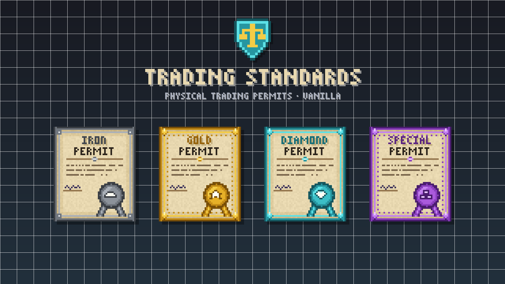
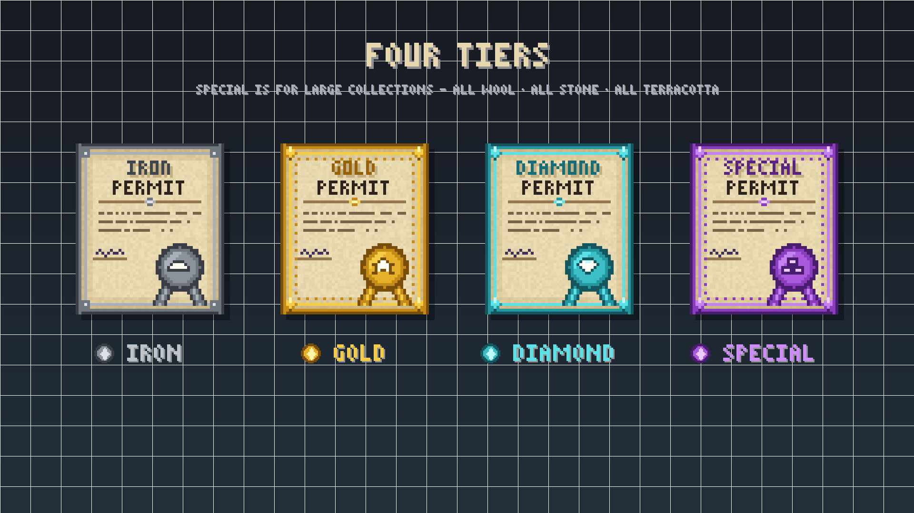
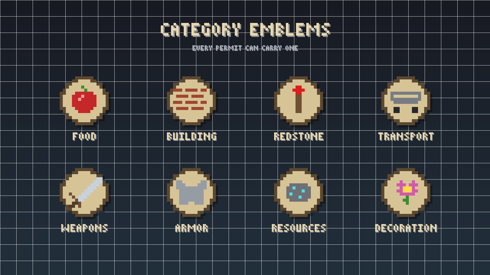

> **Looking for the download?** Trading Standards is distributed on [Modrinth](https://modrinth.com/datapack/trading_standards).
> This repository hosts the documentation and the [issue tracker](../../issues).

# Trading Standards

Physical trading permits for your server's shopping district, built entirely in vanilla: a datapack and a resource pack, with no mods or plugins.

Admins issue permits: real, holdable items that license a player to trade something, like *Apple* or *All Wool*. Every permit is checked against a central registry, so it can't be forged, copied, renamed, or picked up and passed off as someone else's.

## Features

- **Physical permits.** Each shows its subject, holder, ID and tier, and is a 3D card in hand, on the ground and in item frames.
- **Four tiers:** Iron, Gold, Diamond, and Special for large collections.
- **Category emblems** for food, building, redstone, transport, weapons, armor, resources and decoration.
- **Tamper-proof verification.** Copies, outdated versions, revoked permits and permits held by the wrong player all fail.
- **In-game admin screens** to issue, look up, transfer, reissue and revoke permits, plus a registry browser and an audit log.
- **Full history** for every permit.

## Compatibility

| Minecraft | Trading Standards |
|---|---|
| Java 26.3 | 1.1.0 |
| Java 26.2 | 1.0.0 (no Special tier) |

It works on vanilla, Paper, Fabric or any other server software, and in singleplayer.

## Installation

Both packs are required.

1. **Datapack:** place it in `world/datapacks/` and restart the server.
2. **Resource pack:** set it as the server resource pack in `server.properties` so players receive it automatically. Without it, permits appear as plain paper.
3. As an operator, run `/function trading_standards:admin/menu`.

## Documentation

- **[Admin Guide](docs/ADMIN_GUIDE.md):** issuing and managing permits, officers, verification results, the command reference and troubleshooting.
- **[Changelog](CHANGELOG.md)**

## Reporting a bug

[Open an issue](../../issues/new/choose) using the bug report template. Please include:

- your Minecraft version and Trading Standards version;
- the output of `/data get storage trading_standards:meta version`;
- steps to reproduce, and any errors from the server log after `/reload`.

Before reporting, check that both packs are installed and match your Minecraft version. Mismatched packs cause most problems.

## License

All Rights Reserved. See [LICENSE](LICENSE). Please don't redistribute or re-upload the packs; link to the Modrinth page instead.
