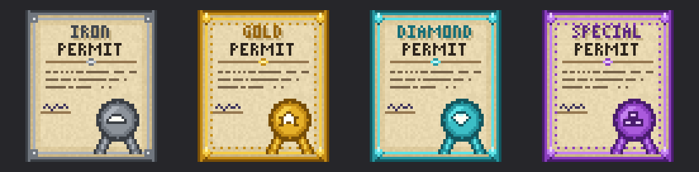
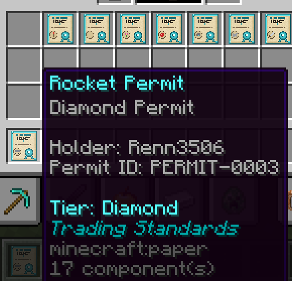
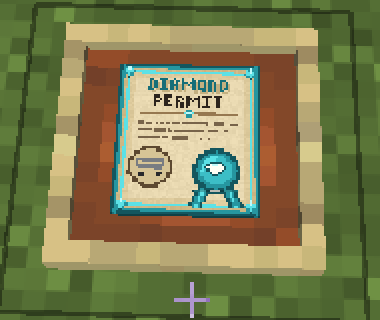
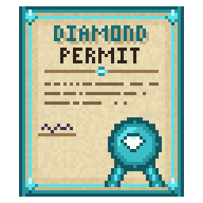
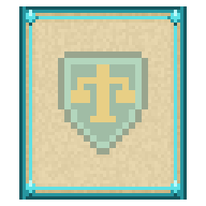

<p align="center"></p>

# Trading Standards: Admin Guide

Trading Standards lets you issue **permits**: physical items that license a player to trade something. The server keeps a central **registry**, and a permit is only valid if the registry says so. Copying, renaming or picking up someone else's permit does not make it valid.

This guide covers Trading Standards v1.1.0 for Minecraft Java Edition 26.3. (Servers still on 26.2 run v1.0.0, which has no Special tier.)

---

## Contents

1. [Setup](#1-setup)
2. [The permit](#2-the-permit)
3. [Opening the admin screen](#3-opening-the-admin-screen)
4. [Issuing a permit](#4-issuing-a-permit)
5. [Managing permits](#5-managing-permits)
6. [Checking a permit](#6-checking-a-permit)
7. [What players can do](#7-what-players-can-do)
8. [Officers](#8-officers)
9. [Danger Zone](#9-danger-zone)
10. [Command reference](#10-command-reference)
11. [Troubleshooting](#11-troubleshooting)

---

## 1. Setup

1. Put `trading_standards_v1.1.0.zip` in `world/datapacks/` and **restart** the server.
2. Make sure every player has `Trading Standards Resources v1.1.0.zip`. The easiest way is to set it as the server resource pack in `server.properties`. Without it, permits look like plain paper and the menus have missing icons.
3. Check the pack is loaded with `/datapack list`.

Optional: `/gamerule logAdminCommands false` stops operators' chat filling with `[Player: ]` echoes when players press menu buttons.

---

## 2. The permit

<p align="center"></p>

Every permit has a **tier**. Tiers are cosmetic, so your server decides what each one means (for example, Diamond for a shop's main product line).

| | Tier | Look |
|:-:|---|---|
|  | **Iron** | Steel border, plain seal |
|  | **Gold** | Gold border, dotted filigree, star seal |
|  | **Diamond** | Cyan border, gem corners, diamond seal |
|  | **Special** | Purple border, gem corners and filigree, stacked-blocks seal. Meant for large collections such as *All Terracotta*, *All Wool* or *All Stone* |

### What's written on it



| Line | Example |
|---|---|
| Name (tier colour) | **Rocket Permit** |
| Subtitle | Diamond Permit |
| Holder | Renn3506 |
| Permit ID | PERMIT-0003 |
| Tier | Diamond |
| Footer | *Trading Standards* |

The name and lore are **display only**. Renaming a permit in an anvil changes nothing, because validity always comes from the registry.

<br clear="right">

### Category emblems

Each permit can carry an emblem for its category. The emblem is shown in the lower-left of the permit.

| | Category | | Category |
|:-:|---|:-:|---|
|  | `food` |  | `weapons` |
|  | `building` |  | `armor` |
|  | `redstone` |  | `resources` |
|  | `transport` |  | `decoration` |

Use `none` for no emblem.

### In the world



Held, dropped or framed, a permit is a 3D card with a raised wax seal. The back shows the Trading Standards crest. Players often frame their permits in their shops.

<br clear="right">

<p align="center"> &nbsp; <br><sub>Front and back</sub></p>

---

## 3. Opening the admin screen

```
/function trading_standards:admin/menu
```

This opens the admin screen and makes you an **officer** (see [Officers](#8-officers)). Once you are an officer, the permit menu also shows an  **Administration** button, so you can reach the admin screen by right-clicking any permit you hold.

| Button | Use it to |
|---|---|
|  **Issue Permit** | Create a new permit |
|  **Registry** | See every permit; click one to open it |
|  **Look Up** | Open a permit by ID |
|  **Transfer** | Move a permit to a new holder |
|  **Reissue** | Replace a lost permit |
|  **Revoke** | Cancel a permit |
|  **Audit Log** | See recent activity |
|  **Danger Zone** | Revoke everything, or reset the pack |

Form results are reported in chat.

---

## 4. Issuing a permit

Open **Issue Permit** and fill in:

| Field | What to enter |
|---|---|
| Player name | The holder's exact in-game name (case-sensitive). They must be **online**. |
| Subject | What the permit authorises, in your own words: a single item (`Apple`), a collection (`All Wood`, `All Wool`), or anything your server's rules need. |
| Category | The emblem. Pick **None** for no emblem. |
| Tier | Iron, Gold, Diamond, or Special for large collections. |

The permit goes straight into the player's inventory and gets the next ID (`PERMIT-0001`, `PERMIT-0002`, …).

The same thing as a command:

```
/function trading_standards:admin/create {player:"Renn3506",subject:"All Wool",tier:"gold",category:"decoration"}
```

> **Rules for text fields:** don't use double quotes (`"`) in names or subjects. Use `category:""` for no emblem.

---

## 5. Managing permits

### Look up a permit

**Registry** lists every permit as a button. Click one, or use **Look Up** with an ID, to see:

- subject, holder, tier and status;
- who issued it;
- its full history (issued, transferred, reissued, revoked, with day and admin).

The record screen has **Transfer**, **Reissue** and **Revoke** buttons with the ID already filled in.

### Transfer: a new holder

Moves the permit to another player (who must be online). It is still the same permit with the same ID.

- The new holder receives a fresh copy.
- The old holder's copy is removed if they are online, and fails verification anywhere else.

### Reissue: lost or damaged permit

Gives the current holder (who must be online) a fresh copy. Any older copy of that permit stops working.

### Revoke: cancel a permit

Permanent; you must tick a confirmation box. The permit stays in the registry with its history, but every copy now fails verification as **revoked**.

### Audit Log

The 40 most recent events across the whole pack, newest first: issues, transfers, reissues, revocations, officer changes and resets. The last 500 events are kept, and each permit's own history is never trimmed.

---

## 6. Checking a permit

A permit is checked against the registry every time it is inspected. These are the possible results:

| | Result | Meaning |
|:-:|---|---|
|  | **Verified** | Active, held by its registered holder, current copy |
|  | **Revoked** | Cancelled by an admin |
|  | **Not held by registered holder** | Someone else is holding it |
|  | **Out of date** | A newer copy exists (after a transfer or reissue) |
|  | **Not in the registry** | Unknown ID (e.g. from before a reset) |
|  | **Corrupted** | The item's data was tampered with |

To check a permit a player is holding, from anywhere:

```
/function trading_standards:admin/inspect {player:"Renn3506"}
```

---

## 7. What players can do

Players need no permissions. **Their permit is their only way into the system.**

- **Right-click a permit** to open its card, which shows the permit, whether it is valid, and its details.
-  **Present** shows the permit's verification in chat to everyone within 8 blocks. This is useful when a customer asks to see a licence.
-  **Menu** opens:
  -  **My Permits**: every permit registered to them, with tier and status;
  -  **Inspect Held**: the card again;
  -  **Present Held**: as above.

Menu buttons only work while the player is holding a permit.

---

## 8. Officers

Officers can use the admin screen's buttons and see the **Administration** button in the permit menu.

| Action | Command |
|---|---|
| Make someone an officer | `/function trading_standards:admin/officer/add {player:"Name"}` |
| Remove an officer | `/function trading_standards:admin/officer/remove {player:"Name"}` |

Running `admin/menu` makes you an officer automatically. Submitting forms (issuing, revoking and so on) still needs **operator** permission.

---

## 9. Danger Zone

Found at the bottom of the admin screen.

| Action | Confirm by | Effect |
|---|---|---|
| **Revoke All Permits** | Ticking the box | Every active permit is revoked. History is kept. |
| **Reset Pack** | Typing `RESET` | Deletes the registry and audit log and restarts numbering at PERMIT-0001. Removes permits from online players and clears all officers except you. |

Both announce themselves to all players. Neither can be undone.

To remove Trading Standards from a world completely:

```
/function trading_standards:admin/uninstall {confirm:"UNINSTALL"}
```

Then disable the pack straight away using the link it prints in chat. Otherwise the next reload reinstalls it.

---

## 10. Command reference

Every command starts with `/function trading_standards:`. `admin/help` prints this list in game.

| Command | Arguments |
|---|---|
| `admin/menu` | none |
| `admin/create` | `{player:"",subject:"",tier:"",category:""}` |
| `admin/transfer` | `{id:"",player:""}` |
| `admin/reissue` | `{id:""}` |
| `admin/revoke` | `{id:""}` |
| `admin/inspect` | `{player:""}` |
| `admin/lookup` | `{id:""}` |
| `admin/list` | none |
| `admin/audit` | none |
| `admin/officer/add` | `{player:""}` |
| `admin/officer/remove` | `{player:""}` |
| `admin/revoke_all` | `{confirm:"yes"}` |
| `admin/reset` | `{confirm:"RESET"}` |
| `admin/uninstall` | `{confirm:"UNINSTALL"}` |
| `admin/debug/on`, `admin/debug/off` | none |

---

## 11. Troubleshooting

| Problem | Fix |
|---|---|
| "Player not found" | The player must be online, and the name is case-sensitive. |
| Permit looks like plain paper, or icons show as purple/black squares | The player doesn't have the resource pack. Re-enable it or press F3+T. |
| Right-clicking a permit does nothing | It's from a pre-release build and will upgrade the next time the player's inventory changes. If not, use **Reissue**. |
| A player lost their permit | **Reissue** it; the lost copy stops working. |
| Menu buttons show "Hold a permit to use Trading Standards" | The player must be holding a permit in either hand. |
| A command did nothing and printed an error about arguments | Check every argument is present and nothing contains a double quote. |
| An empty line appears in chat when players press buttons | A vanilla limitation of `/trigger`, and harmless. |
